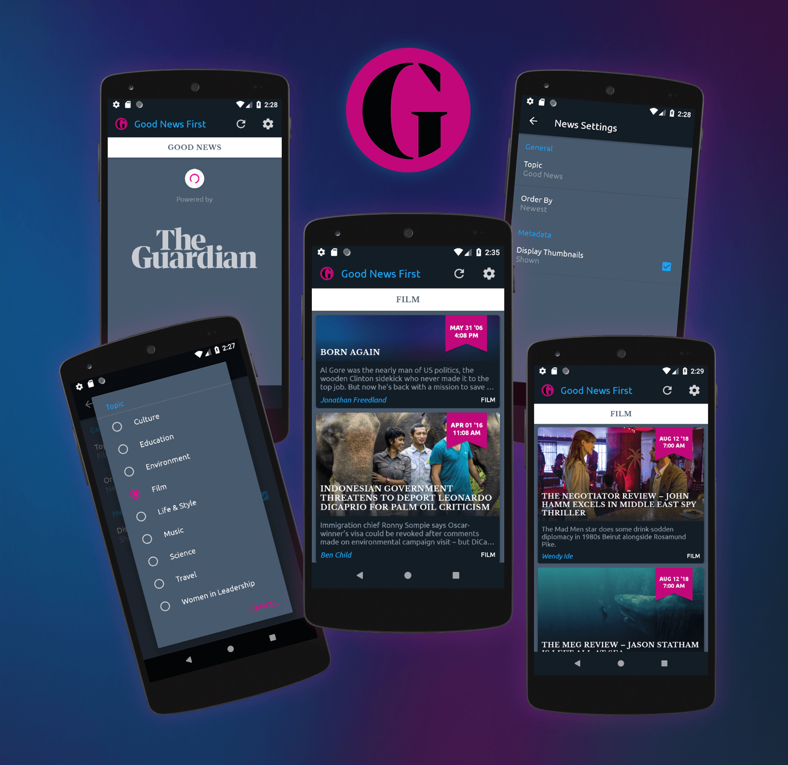

## Grow With Google Android Basics Nanodegree: PROJECT 6 & 7
# News App Part 1 & Part 2 - Good News First

Used **API 27: Android 8.1 (Oreo)**

## Screenshots

## Walkthrough

_[Watch on YouTube](https://www.youtube.com/watch?v=v0DIsGFnqUE)_

## Project Rubric
Create a news app from the Guardian API that displays multiple news stories. The app queries the content.guardianapis.com API using JSON to fetch news stories related to the topic chosen by the user, using an API key. Each story clicks through to its web url for the full story. The app should gracefully deal with older news articles that may not have a thumbnail or author. There should be a Settings Activity via the toolbar. The user's preferences should narrow the query down and change the results. The preferences should be stored on the device/data persistence. Network operations are done using Loader rather than AsyncTask.

## Resources

*Hidden API Key:*
1. Sign up for a Guardian API Key: https://open-platform.theguardian.com/access
2. In your gradle.properties file add: GoodNewsFirst_GuardianApp_ApiKey="your-API-key-goes-here".
3. Based on instructions here: https://medium.com/code-better/hiding-api-keys-from-your-android-repository-b23f5598b906

*Pull to refresh:*
https://guides.codepath.com/android/implementing-pull-to-refresh-guide

*Guardian Logo for attribution:*
https://commons.wikimedia.org/wiki/File:The_Guardian_2018.svg

*Music track:*
Aljosha Konstanty - Discovery

_Many thanks to <a href="https://github.com/gundamboy" target="_blank">Charles Rowland</a> for his help figuring out the trickier elements of this project._
